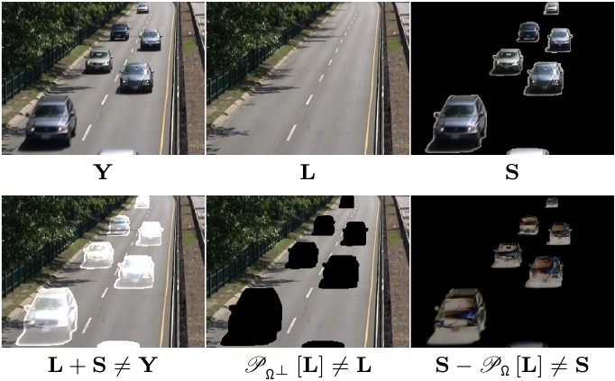
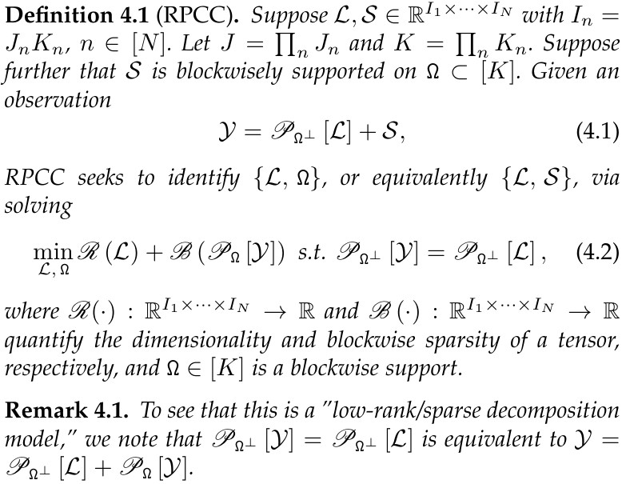
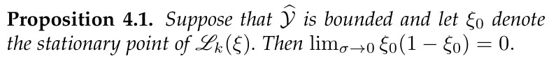
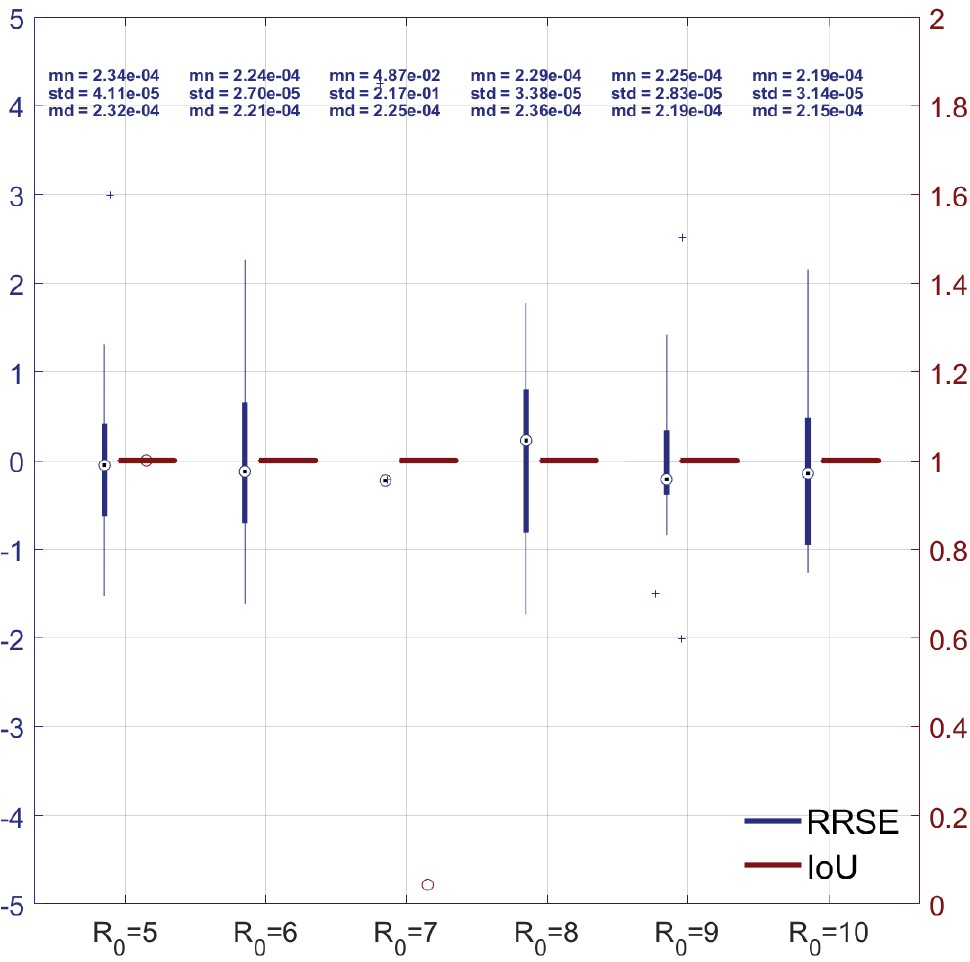
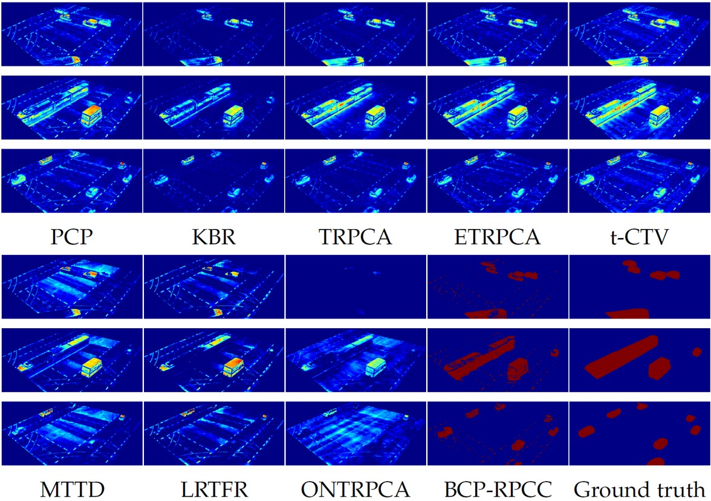
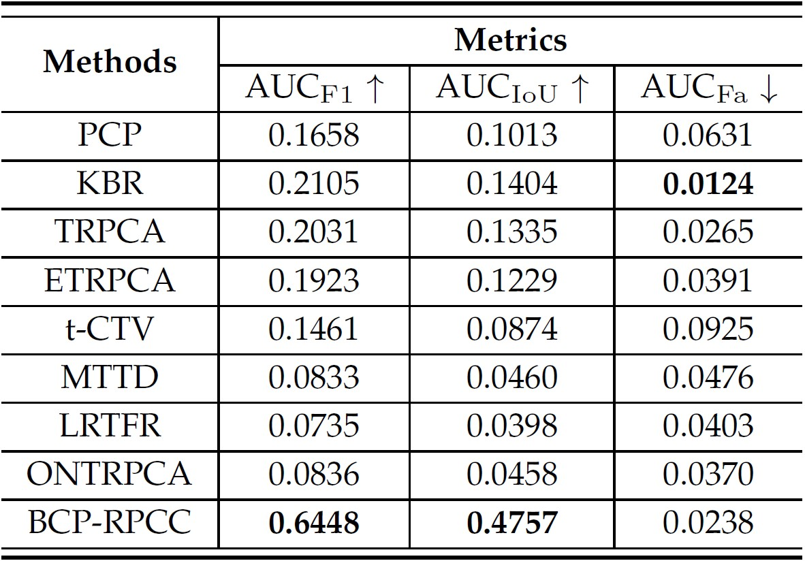
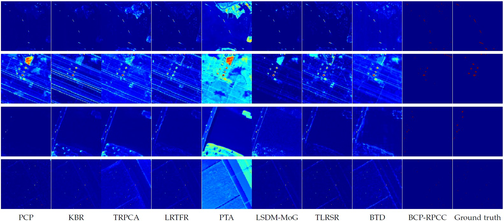
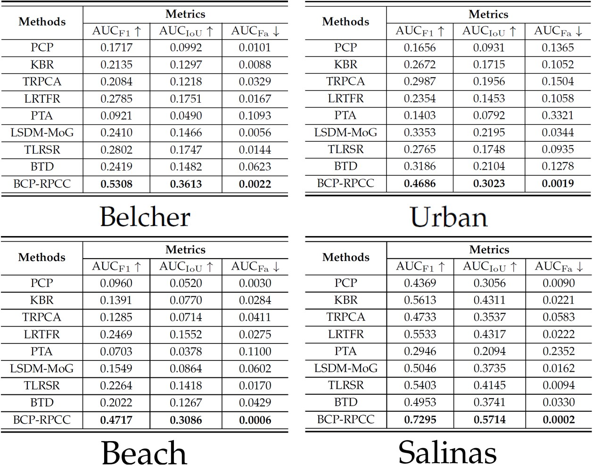

# 鲁棒主成分分析（RPCA）的新范式——鲁棒主成分补全（RPCC）：一种NP难问题的通解？

Paper: <https://arxiv.org/abs/2603.25132>
Code: <https://github.com/WongYinJ/BCP-RPCC>

## 问题背景
鲁棒主成分分析（Robust Principal Component Analysis, RPCA）作为首个多项式时间内可规模化的低秩-稀疏分解方法，在过去十多年内得到了长足发展，并被广泛用于去噪及前后景分割的任务。数学上，RPCA 问题旨在寻找一个低秩分量 $\mathcal{L}$ 和一个稀疏分量 $\mathcal{S}$，使得观测 $\mathcal{Y}$ 满足
$$
\mathcal{Y} = \mathcal{L} + \mathcal{S}. \tag{1}
$$
然而，这种 RPCA 形式与许多应用所面临的实际情形存在一定的失配。也就是说，式(1)将稀疏的异常值或离群点 $\mathcal{S}$ 描述为叠加在低维背景 $\mathcal{L}$ 上的加性分量。然而，在大多数实际应用中，异常值在物理上并非“叠加”于背景，而是“取代”或“遮挡”了背景。于是，更准确的低秩-稀疏分解模型应由下式体现：
$$
\mathcal{Y} = \mathscr{P}_{\mathtt{\Omega}^{\bot}}\bigl[\mathcal{L}\bigr] + \mathcal{S}, \tag{2}
$$
其中 $\mathtt{\Omega}$ 表示 $\mathcal{S}$ 的支撑集，$\mathtt{\Omega}^{\bot}$ 是其补集，而 $\mathscr{P}_{\mathtt{\Omega}^{\bot}}\left[\cdot\right]$ 表示到支撑于 $\mathtt{\Omega}^{\bot}$ 上的矩阵子空间的正交投影算子。

  
   
  <em>图1：RPCA与实际情况的失配。</em>

图1对RPCA和实际情况的失配进行了示意，从中可以清晰地看到，低秩背景 $\mathcal{L}$ 和稀疏前景 $\mathcal{S}$ 的直接加和 $\mathcal{L}+\mathcal{S}$ 并不能得到观测数据 $\mathcal{Y}$ 。于是，继续使用式(1)的形式进行求解有极大可能会使模型发生偏移，因为真值解并不在(1)所给出的可行域内。即使在最理想的情况下，我们或许能精确估计到 $\mathcal{L}$ 或 $\mathcal{S}$ 的其中一个，随后再另寻方法估计另一个。然而，由于模型本身是失配的，这种理想状况近乎奢求。

事实上，这样一种**失配**并不难注意到；在注意到它之后，也不难写出式(2)进行修正。真正困难的点在于对式(2)的求解，因为对支撑集 $\mathtt{\Omega}$ 的估计是**NP难**的组合优化问题。过去，只有少数**任务专有**的解法被提出，尽管它们在各自针对的场景中表现优秀，但不具备对任意维度、任意形态数据的泛化能力。并且，这些工作中所给出的算法多为“启发式”的。由于缺乏收敛性和最优性的分析工具，使得其极难被扩展为针对一般数据的**通用框架**。于是，在多数情况下，尽管我们明知式(1)是失配的，仍然不得不继续基于它解决问题。

## 本文贡献
本文摒弃了传统的 RPCA 形式，提出了一种称为鲁棒主成分补全（Robust Principal Component Completion, RPCC）的框架，尝试对问题(2)进行直接求解。这意味着RPCC需要直接对支撑集 $\mathtt{\Omega}$ 进行估计，稀疏分量 $\mathcal{S}$ 则通过支撑集来间接获得。同时，为了处理任意维度的数据，我们将整个问题建模为张量形式，并采用贝叶斯稀疏张量分解（Bayesian Sparse Tensor Factorization, BSTF），通过变分贝叶斯推断（Variational Bayesian Inference, VBI）进行求解。主要贡献如下：

**（1）更符合实际问题的建模：** RPCC 准确描述了稀疏分量并非“叠加”于低维背景，而是实际“替换”或“遮挡”了背景元素。从张量角度出发，RPCC 可处理任意维度的数据，并支持块状或元素级的稀疏模式，灵活适配常见的数据结构。

**（2）基于贝叶斯 CP 分解的求解算法：BCP-RPCC** 我们基于贝叶斯CP分解，构建了BCP-RPCC，作为对RPCC的求解算法。该方法通过稀疏诱导层次分布刻画“背景”的低 CP 秩和“前景”的分块稀疏性。对于支撑集 $\mathtt{\Omega}$ 的**NP难**优化问题，我们将其近似为概率二分类问题，通过贝叶斯推断直接给出每个块属于稀疏模式的后验概率。在生成模型中，我们引入已知方差的高斯噪声提供随机性，避免额外参数估计。得益于该噪声方差的已知性，本文从理论上证明，当噪声方差足够小时，所提算法框架能够收敛为一个**硬分类器**，从而实现了对支撑集 $\mathtt{\Omega}$ 的**硬求解**。伴随而来的好处是，基于传统 RPCA 的前/后景分割任务中极其困难的后验阈值设定步骤，被彻底消除。

**（3）首个一般性可解框架：** BCP-RPCC 首次证明，对于任意维度或类型的数据，问题(2)是普遍可解的。受益于贝叶斯概率学习和 VBI的扎实理论基础，该算法的收敛性与最优性均是可分析的，使其成为了一个理论健壮的求解框架，从而在大量的理论及应用问题中具备良好的可外推性。事实上，RPCA 本质上是 RPCC 的一个凸替代（Convex Surrogate），是在无法求解(2)时的一种妥协。而 BCP-RPCC 的出现使得相关任务有了“不再妥协”的可能。
## 模型要点
详细的模型构建与求解过程见于原文，此处仅对模型要点作简单梳理。
### RPCC的定义

  
   

### BCP-RPCC的构建
**（1）随机性的引入：** 我们首先在观测 $\mathcal{Y}$ 中引入加性噪声 $\mathcal{E}\in\mathbb{R}^{I_1\times\cdots\times I_N}$，其元素独立同分布地取自 $\mathcal{N}(0,\sigma)$。也就是说，我们不直接从 $\mathcal{Y}$ 估计 $\left(\mathcal{L},\,\mathtt{\Omega}\right)$（或等价地 $\left(\mathcal{L},\,\mathcal{S}\right)$），而是从其带噪版本
$$
\widehat{\mathcal{Y}}\triangleq\mathscr{P}_{\mathtt{\Omega}^\bot}\left[\mathcal{L}\right]+\mathcal{S}+\mathcal{E}=\mathcal{Y}+\mathcal{E}. \tag{3}
$$

中进行估计。需注意，高斯噪声项是BSTF中常见的随机性来源，但通常被假设内嵌于观测 $\mathcal{Y}$ 中，因此需要对噪声方差 $\sigma$ 进行估计。与此不同，为避免 RPCC 出现参数冗余，我们遵循经典 RPCA （即式(1)）的设定，假设观测 $\mathcal{Y}$ 是无噪声的。于是，式 (3) 引入方差 $\sigma$ **已知**的噪声 $\mathcal{E}$，为BSTF模型构建提供了必要的随机性，同时又无需引入额外的待定变量。
**（2）基于混合分布的支撑集建模：** 构建一个计算上可处理的模型来对 $\mathcal{S}$ 的支撑集进行辨识是 RPCC 中的关键挑战。由式(3)可得：
$$
\begin{aligned}
\widehat{\mathcal{Y}} &= \mathscr{P}_{\mathtt{\Omega}^\bot}\left[\mathcal{L}\right] + \mathscr{P}_{\mathtt{\Omega}}\left[\mathcal{S}\right] + \mathcal{E} \\
&= \mathscr{P}_{\mathtt{\Omega}^\bot}\left[\mathcal{L}+\mathcal{E}\right] + \mathscr{P}_{\mathtt{\Omega}}\left[\mathcal{S}+\mathcal{E}\right],
\end{aligned}
\tag{4}
$$
这表明 $\widehat{\mathcal{Y}}$ 由两个模式——$\mathcal{L}+\mathcal{E}$ 和 $\mathcal{S}+\mathcal{E}$——“择一”或“混合”生成，从而使我们联想到**混合高斯分布**。受此启发，我们相应地将 $\widehat{\mathcal{Y}}$ 的生成模式建模为混合分布。即，对于 $\widehat{\mathcal{Y}}$ 中的第$k$个“元素块” $\mathbf{y}^{[K]}_k$，我们有

$$p\left(\widehat{\mathbf{y}}^{[K]}_k\bigm\vert\mathtt{\Theta}_L,\,\mathtt{\Theta}_S,\sigma,\eta\right) = 
  (1-\eta)p\left(\widehat{\mathbf{y}}^{[K]}_k\bigm\vert\mathtt{\Theta}_L,\sigma\right)
  +\eta p\left(\widehat{\mathbf{y}}^{[K]}_k\bigm\vert\mathtt{\Theta}_S,\sigma\right),\tag{5}$$

其中 $p\left(\widehat{\mathbf{y}}^{[K]}_k \bigm\vert \mathtt{\Theta}_L,\sigma\right)$ 和 $p\left(\widehat{\mathbf{y}}^{[K]}_k \bigm\vert \mathtt{\Theta}_S,\sigma\right)$ 分别是 $\mathcal{L}+\mathcal{E}$ 和 $\mathcal{S}+\mathcal{E}$ 的生成模型，且 $\eta\in[0,1]$。依据混合高斯分布的经验，式 (5) 可等价地由一个两层模型生成：
$$
\begin{aligned}
p\Big(\widehat{\mathbf{y}}^{[K]}_k \bigm\vert \mathtt{\Theta}_L,\,\mathtt{\Theta}_S,\sigma,z_k\Big) 
= p^{1-z_k}\left(\widehat{\mathbf{y}}^{[K]}_k \bigm\vert \mathtt{\Theta}_L,\sigma\right)p^{z_k}\left(\widehat{\mathbf{y}}^{[K]}_k \bigm\vert \mathtt{\Theta}_S,\sigma\right),
\end{aligned}
\tag{6}
$$

$$
p\left(z_k \bigm\vert \eta\right) = \eta^{z_k}(1-\eta)^{1-z_k}, \quad z_k\in\{0,1\}.\tag{7}
$$
于是，$\widehat{\mathbf{y}}^{[K]}_k \bigm\vert \left\{\mathtt{\Theta}_L,\,\mathtt{\Theta}_S,\sigma,z_k\right\}$ 的分布要么是 $p\left(\widehat{\mathbf{y}}^{[K]}_k \bigm\vert \mathtt{\Theta}_L,\sigma\right)$，要么是 $p\left(\widehat{\mathbf{y}}^{[K]}_k \bigm\vert \mathtt{\Theta}_S,\sigma\right)$，取决于伯努利变量 $z_k$ 取 $0$ 或 $1$。此即实现了一种**非前景即后景**的支撑集分割。在为 $\eta$ 分配共轭先验后，我们便可利用 ${z}_k $ 的后验均值来度量第 $k$ 个元素块以 $\mathcal{S}$ 为来源的概率。直到此时，我们依然认为支撑集 $\mathtt{\Omega}$ 的估计必须通过对所有 ${z}_k$ 的后验均值进行**阈值化**来实现，即对支撑集的直接求解是不可能的。但在随后的收敛性分析中我们发现，这种直接求解的可能性，就蕴藏在所引入的噪声方差$\sigma$中。

**（3）低秩与稀疏成分建模：** 低秩分量 $\mathcal{L}$ 与稀疏分量 $\mathcal{S}$ 的建模遵循BSTF的常规范式。些许细节上的变化见于原文。

**（4）收敛性分析：** 所得全概率模型的后验推断遵循经典的VBI框架，该框架的收敛性是已知的，即模型最终收敛于证据下界（Evidence Lower BOund, ELBO）关于各变量的驻点。此处，我们感兴趣的是 ${z}_k $ 的后验均值， 记为$\bar{z}_k$， 的收敛行为。因为该后验均值为 RPCC 中关键挑战——支撑集划分——提供了解决方案。为此，我们从ELBO中提取与 $\bar{z}_k$ 相关的项，记为
$$
\mathscr{L}_{k}\left(\bar{z}_k\right) \triangleq \bar{z}_k \left(A_k - B_k\right) + h(\bar{z}_k), \tag{8}
$$
可见其形式并不复杂。于是，简单地分析其驻点的性质，可得

  
   

此即，当噪声方差 $\sigma$ 趋于 $0$ 时，后验均值 $\bar{z}_k$ 明确地收敛到 $0$ 或 $1$，而不是任何中间值。这种收敛意外地使BCP-RPCC成为一个硬分类器，为支撑集的分割提供了“almost sure”的决策。因此，所提出的模型消除了对 RPCA 公式中软分类器通常所需的后验阈值化步骤的依赖。在实践中，此类阈值往往难以确定，因为与之相关的先验知识几乎不存在，选择阈值有时甚至比求解RPCA本身要困难得多。相比之下，我们的模型通过收敛到一个明确的支撑集分割结果，完全绕过了这一障碍。

更重要的是，这种非$0$即$1$的收敛意味着BCP-RPCC实现了对支撑集$\mathtt{\Omega}$的直接估计，说明问题(2)存在着被直接求解的可能。

## 实验探究
此处摘录部分实验与相应的关键结论，完整的实验部分见于原文。
### 模拟数据

  
   
  <em>图2：模拟数据实验效果。低秩背景L的重建效果由相对均方根误差（Relative Root Squared Error）衡量；稀疏前景S的支撑集Ω的重建效果由交并比（Intersection over Union, IoU）衡量。 </em>

我们看到，RRSE 的中位数保持在 $2.5\times10^{-4}$ 以下，而在大多数情况下，标准差还要再低一个数量级。即使在其他标准差增大到 $10^{-1}$ 左右的情形中，相应的箱线图也收缩为单个点，这表明较大的标准差是由少数异常值（显示为蓝色十字）引起的。IoU 的箱线图在所有分组中均为 $\operatorname{IoU}=1$ 处的一条直线，仅可见少数异常值（显示为红色圆圈）。鉴于这些异常值的稀疏性，我们得出结论：所提出的模型以高概率实现了原始 RPCC 问题的near-optimal解，考虑到该问题的 NP难性质，这是一个令人惊喜的结果。
### 真实数据
我们在彩色视频及高光谱图像上验证BCP-RPCC的前景提取能力。我们的模型的主要突破点在于对支撑集$\mathtt{\Omega}$的直接估计，也即它是“硬分类器”，但主流的**通用模型**均只能给出$\mathtt{\Omega}$的软分类结果。据我们所知，目前并不具备对硬分类器和软分类器直接进行比较的评价指标，为此，我们不得不定制新的指标。

具体而言，我们首先选取硬分类器的三种常用度量，即 F1-score、IoU以及虚警率。对于软分类器，这三个度量成为阈值 $\tau$ 的函数，分别记为 $\operatorname{F1}(\tau)$、$\operatorname{IoU}(\tau)$ 和 $\operatorname{Fa}(\tau)$，我们使用其曲线下面积（AUC），即
$$
\begin{aligned}
    \text{AUC}_{\operatorname{F1}}&=\int_{0}^{1}\operatorname{F1}(\tau)\,d\tau,\\
    \text{AUC}_{\operatorname{IoU}}&=\int_{0}^{1}\operatorname{IoU}(\tau)\,d\tau,\\
    \text{AUC}_{\operatorname{Fa}}&=\int_{0}^{1}\operatorname{Fa}(\tau)\,d\tau 
\end{aligned}
$$
作为评价指标。需要指出的是，对于 BCP-RPCC ，$\operatorname{F1}(\tau)$、$\operatorname{IoU}(\tau)$ 和 $\operatorname{Fa}(\tau)$ 是常数。
**（1）彩色视频：**

  
   
  <em>图3：彩色视频实验视觉效果。 </em>

  
   
  <em>表1：彩色视频实验数值效果。 </em>

**（2）高光谱数据：**

  
   
  <em>图3：彩色视频实验视觉效果。 </em>

  
   
  <em>表1：彩色视频实验数值效果。 </em>

- **唯一提供硬分类结果的算法**  
  在所有对比方法中，只有 BCP-RPCC 直接输出二元预测（前景/背景或异常/正常），而其他基于 RPCA 的方法均输出软分类结果，需要后续阈值化处理。

- **定性结果更接近真值**  
  可视化显示，BCP-RPCC 检测出的前景区域与真值图的重叠度最大，且虚警明显少于其他方法；对于高光谱数据，BCP-RPCC 产生的虚警极少，而对比方法易出现大量误检。

- **定量指标整体占优**  
  在 $\text{AUC}_{\text{F1}}$ 和 $\text{AUC}_{\text{IoU}}$ 两个指标上，BCP-RPCC 在所有数据集上均取得最优或接近最优的性能；在三个指标的综合评价中，BCP-RPCC 也表现出最佳的整体效果。

- **软分类方法的阈值敏感性问题**  
  基于 RPCA 的软分类方法虽可能在某一个极窄的阈值区间内达到略高于 BCP-RPCC 的峰值性能，但该区间随数据集变化显著，且在实际应用中无法获得真值来指导阈值选择。相比之下，BCP-RPCC 无需任何后验阈值，直接输出确定性决策，具有更强的实用性和鲁棒性。
## 后续展望
尽管 BCP-RPCC 在峰值性能上可能不及传统 RPCA，但这**并非**本文意图传递的核心信息。通过直接估计稀疏分量的支撑集，它完全消除了阈值化的后处理步骤——这一步往往比求解 RPCA 模型本身更为棘手。读者可能会认为阈值仍以超参数 $\sigma$（即所加噪声的方差）的形式隐式存在。然而，二者存在本质区别：通过将事后阈值 $\tau$ 转化为事前“阈值” $\sigma$，阈值化步骤成为低秩/稀疏分解模型的内在组成部分，而 $\tau$ 则不具备这一特性。这一转变使得像 RPCA(<https://doi.org/10.1145/1970392.1970395> )中的平衡参数 $\lambda$ 那样从理论上确定 $\sigma$ 成为可能。正如本文的命题4.1所确立的，$\sigma$ 与低秩分量的拟合误差强相关。相比之下，对于事后阈值 $\tau$，我们几乎没有任何类似的关联线索。

于是，本研究为多个兼具理论和实践意义的研究方向提供了一个起点：
- **可识别性分析**：  
  类似于 RPCA，现在理解 RPCC 在何种条件下能够识别低秩分量及其支撑集的真实后验分布、以及能达到何种精度，具有了重要意义。此类分析将为确定 $\sigma$ 提供理论指导。
  
- **模型改进**：  
  当前模型尚未实现对低秩分量$\mathcal{L}$的满意恢复，这也是本文未像传统RPCS研究那样展示其背景重建性能的原因。这一局限性源于 CP 分解相对较弱的低秩表征能力，导致准确重建背景需要非常大的 CP秩$R$，而这一较大的$R$在常见的计算设备上难以部署。这便催生将 CP 分解替换为更先进的张量分解（如张量奇异值分解、Tucker 分解、张量环分解、张量链分解，以及深度张量网络等）以进一步提升模型性能的潜在研究。
  
- **任务增强**：  
  鉴于所提模型作为硬分类器的重要意义，许多任务导向的研究便可向前更进一步。例如，高光谱异常检测现在可以开启“高光谱**硬**异常检测”的新篇章，开始探讨如何彻底规避阈值化的后处理步骤，使得相关模型的实用性得到强化。
